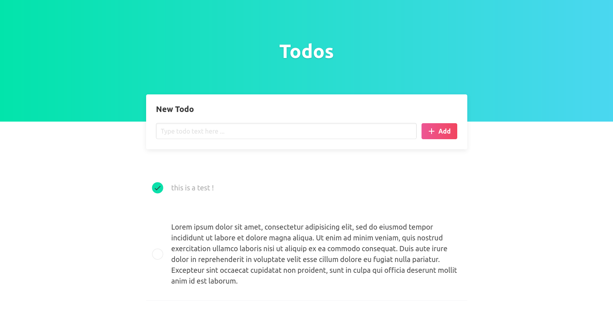
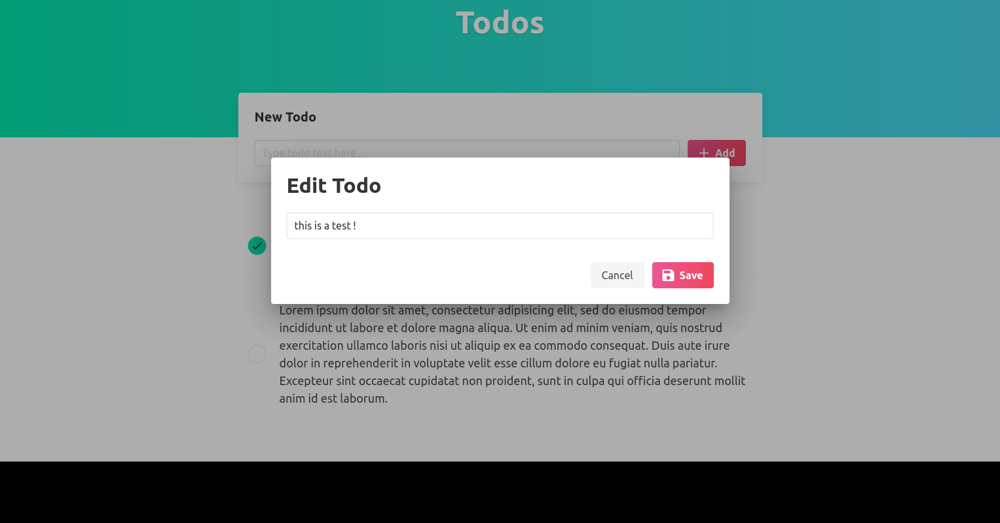

# Bloc Note

## Informations

Premier projet avec le Framework Angular en suivant le [tutoriel](https://www.youtube.com/watch?v=gvWxMQ_Zios&t=3168s) de [Devstackr](https://github.com/Devstackr). Le but est de créer une application pour ajouter, modifier, sélectionner et supprimer des notes.

**date de début :** 31/05/2021

## Développeur

Noé PHILIPPE

## Images

   

   

## Langages

SCSS, HTML5, Javascript

## Framework

**Javascript :** Angular  
**CSS :** Bulma

## Responsive

Oui
